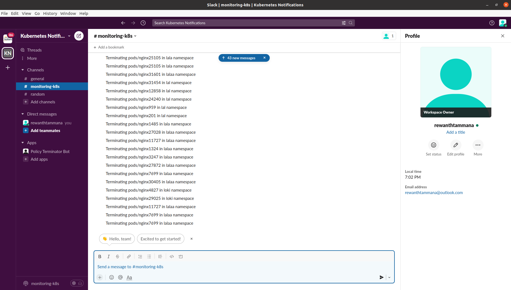
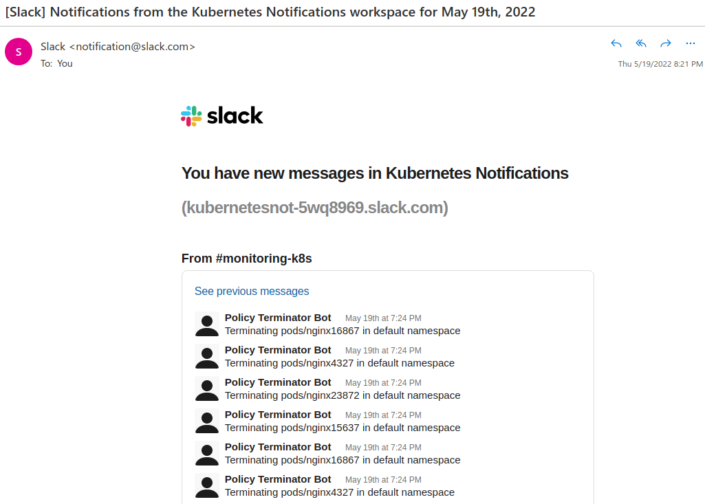

# policy-terminator-bot

Policy Terminator Kubernetes bot to ensure continuous compliance

## Demo

We have 4 infrastructures in our data centers.

1. Iron Man Team
2. Captain America Team
3. Giant Swarm Team
4. Ahoc teams


[Demo Video](./images/Demo.mp4)

## Pre-requisite tools

* Kubernetes 1.23
* helm3 3.8.2
* Kyverno
* Golang 1.18.2 (If you want to build from source)

## Installation

### Populate data

```bash
./scripts/populate-data.sh
```

### Policies

Assuming you have Kyverno & helm3 installed.

If you want customization, edit the `policies/requiredlabels.yaml` accordingly

```bash
helm install required-labels ./policies/
```

### Slack channel configuration

You can either use environment variables or create `config.env` in home directory and populate it with `Token` & `ChannelID`

```
cat config.env
POLICY_TERMINATOR_SLACK_BOT_TOKEN=xoxb-{{...}}
CHANNELID={{...}}
```

### Policy Terminator - Build from scratch

```bash
go get ./...
go run clean.go
```

To get the binary,

```bash
go get ./...
go build -o ./bin/policy-terminator clean.go
```

### Policy Terminator - Use the pre-compiled binary

```bash
./bin/policy-terminator
```

## Screenshots

### Slack



### Email



## Future enhancements

* [x] The end-user/customer should have a visibility on the resources getting deleted. A slack/discord notification would be of great help.
* [ ] Deleting all non-compliant resources isn't a great idea. What if there are some legacy systems & their configuration isn't updated on company's SCM systems? It's smart to have an interactive conversation with customer. A practical approach would be to send notification to the customer & request him for resource deletion like `yes`/`no`. Our webhook will capture the customer response & take action accordingly.
* [ ] Alternatively, we can have a default option like `delete` if there's no response from user in 48 hrs but before deleting it, we can find a way to save the configuration of the resource in a private SCM repo as backup.
* [ ] As of now, the deletion is happening only for pods & deployments. This can be extended to daemonsets, replicasets, statefulsets, jobs and so on.
* [ ] Create a custom RBAC for policy-terminator
* [ ] Dockerize the application
* [ ] There will be a few repeated values in the slack notification. This needs to be fixed.
  * [ ] One such case would be a pod is in "Terminating" phase but still our policy-terminator identifies it as pod & tries to delete it again.
* [ ] Add test cases for the code
* [ ] Add flags to ignore slack notifications
* [ ] Add discord/MS teams/mail notification support
* [ ] Add descriptive message in slack notifications like name of policy violated
* [x] Add auto-generation scripts for demonstration
* [ ] Send message to specific user but for this we need to have user slack id.
    * [ ] For this, maybe we can make an annotation mandatory something like deployment/deployerID.
    * [ ] We extract this user ID information from here & send notifications to the specific user.
* [ ] As we discussed about interactive messages, maybe we can add something like automatic fix. So, we will give 3 options when a policy is violated. Operation on the resource, `yes`/`no`/`fix`? We can maybe have automatic fixes in place.
    * [ ] But being from the security background, I feel this might be tricky. What if someone tampers with the data being sent to the webhook? Maybe we need to think about a way to ensure the data isn't tampered. For ex, there's a possibility for the user to edit the pod/namespace name & he will be elevated privileges to perform deletion operations.

### Security observations

* This will be a critical piece for security because it is capable of deleting anything. All it requires is a small mistake in code/misconfiguration in policy.
* This binary should be built in a GitOps approach. Whenever the policy terminator bot code is changed, the PR must be reviewed by someone from security team. The same rule should be applied to helm charts as well because we don't want anyone to accidentally tamper with the namespaces
* Active monitoring should be performed from k8s pov to ensure that no one is making changes to the policies by logging. There should be alerts configured for whenever someone makes changes to kyverno policies directly from the system.

* Need to ensure this binary isn't exfilterated into other systems. All it requires is 

