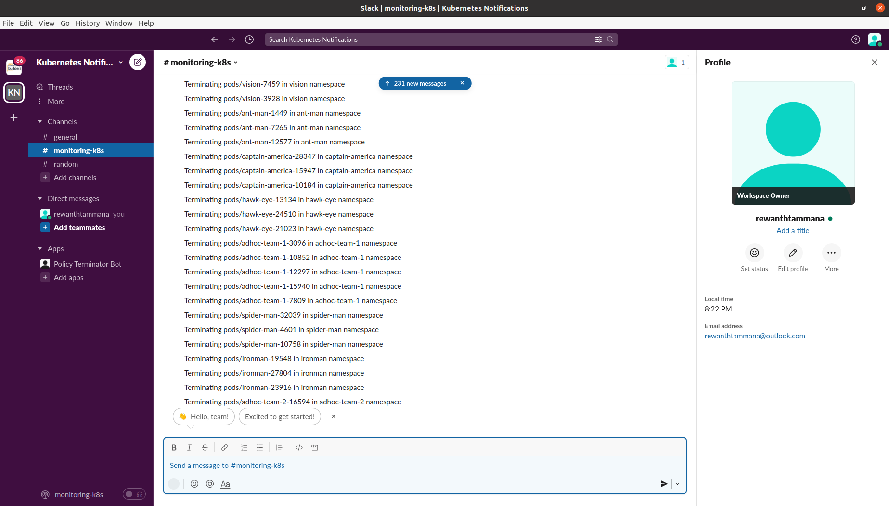

# policy-terminator-bot

Policy Terminator Kubernetes bot to ensure continuous compliance

## Demo

We have 4 infrastructures in our data centers.

1. Iron Man Team
2. Captain America Team
3. Giant Swarm Team
4. Ahoc teams


## Screenshots




## Pre-requisite tools

* Kubernetes 1.23
* helm3 3.8.2
* Kyverno
* Golang 1.18.2 (If you want to build from source)

## Installation

### Policies

Assuming you have Kyverno & helm3 installed.

If you want customization, edit the `policies/requiredlabels.yaml` accordingly

```bash
helm install required-labels ./policies/
```

### Slack channel configuration

You can either use environment variables or create `config.env` in home directory and populate it with `Token` & `ChannelID`

```
cat config.env
POLICY_TERMINATOR_SLACK_BOT_TOKEN=xoxb-{{...}}
CHANNELID={{...}}
```

### Policy Terminator - Build from scratch

```bash
go get ./...
go run clean.go
```

To get the binary,

```bash
go get ./...
go build -o ./bin/policy-terminator clean.go
```

### Policy Terminator - Use the pre-compiled binary

```bash
./bin/policy-terminator
```


## Future enhancements

* [ ] The end-user/customer should have a visibility on the resources getting deleted. A slack/discord notification would be of great help.
* [ ] Deleting all non-compliant resources isn't a great idea. What if there are some legacy systems & their configuration isn't updated on company's SCM systems? It's smart to have an interactive conversation with customer. A practical approach would be to send notification to the customer & request him for resource deletion like `yes`/`no`. Our webhook will capture the customer response & take action accordingly.
* [ ] Alternatively, we can have a default option like `delete` if there's no response from user in 48 hrs but before deleting it, we can find a way to save the configuration of the resource in a private SCM repo as backup.
* [ ] As of now, the deletion is happening only for pods & deployments. This can be extended to daemonsets, replicasets, statefulsets, jobs and so on.
* [ ] Create a custom RBAC for policy-terminator
* [ ] Dockerize the application
* [ ] There will be a few repeated values in the slack notification. This needs to be fixed.
  * [ ] One such case would be a pod is in "Terminating" phase but still our policy-terminator identifies it as pod & tries to delete it again.
* [ ] Add test cases for the code
* [ ] Add flags to ignore slack notifications
* [ ] Add discord/MS teams/mail notification support
* [ ] Add descriptive message in slack notifications like name of policy violated
* [ ] Add auto-generation scripts for demonstration
